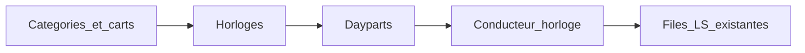

# Automate BUTTON — horloges

Cahier des charges du **premier chantier** : un automate customisable comme une radio.

La liberté est **énumérée** : quatre *quoi*, deux *quand*, une sync si ancré. Pas un plugin infini.

**Hors antenne.** Pas de harbor, pas de live QG, pas de relais, pas de filet plateau, pas d’overlay festival comme commande d’émission. Ça reste dans [`automate.md`](automate.md), plus tard.

| | |
|---|---|
| Statut | Cible — n’est pas la prod |
| Audience | Éditorial BUTTON et technique Radiotomate |
| Licence | AGPL-3.0-or-later, inchangée |
| Spec station (plus tard) | [`automate.md`](automate.md) |
| Feuille horloges | [`automate-horloges-plan.md`](automate-horloges-plan.md) |
| Feuille antenne | [`automate-plan.md`](automate-plan.md) — **en pause** |
| Médiathèque | [`comptes-et-medias.md`](comptes-et-medias.md) |
| Moteur actuel | [`radiotomate-inventaire.md`](radiotomate-inventaire.md) |

Pas de schéma SQL, pas d’écrans, pas de code. Ce document fige le **modèle radio** de l’auto-DJ, y compris les bords (daypart court, ancre molle, cart vide).

---

## 1. Glossaire

| Terme | Sens ici |
|---|---|
| **Catégorie** | Nom stable + requête Beets (musique uniquement). |
| **Cart** | Objet Radiotomate. Jingles, sons, pubs. Pas une 4e médiathèque. |
| **Horloge** | Recette **nommée, réutilisable** : motif séquentiel + ancres optionnelles + catégorie de remplissage si besoin. |
| **Position** | Un **quoi**, une **cible**, un **quand** (séquentiel ou ancré), une **sync** si ancré, un **secours** optionnel. |
| **Quoi** | `musique` \| `jingle` \| `son` \| `pub`. Son et pub = carts ; le nom est éditorial. |
| **Séquentiel** | Après la précédente, dans le **remplissage**. |
| **Ancré** | Minute 0–59 de **chaque heure civile**, seulement si cet instant est **dans** le daypart. |
| **Sync dure** | On coupe pour coller à l’heure. |
| **Sync molle** | On finit le titre ; l’item peut glisser. Si ça dépasse l’ancre dure suivante : **sauté**. |
| **Remplissage** | Entre deux ancres (et avant/après dans l’heure), on boucle le motif séquentiel. |
| **Daypart** | Créneau semaine Auto-DJ : plage → **une** horloge. |
| **Règle** | Séparation artiste / anti-reprise, au tirage **musique** seulement. |
| **Conducteur d’horloge** | ~30–60 min d’items déjà choisis. Pas le conducteur live/relais. |
| **Secours** | Cart ou catégorie déclaré si la cible est vide. Pas du silence politique. |

---

## 2. Objectif

Aujourd’hui l’auto-DJ n’est pas une horloge.

- Daypart ([`AutoDJSlot`](../radiotomate/radiotomate/models/autodj_slot.py)) = filtres Beets pondérés. File vide → un titre au hasard ([`scheduler/live.py`](../radiotomate/radiotomate/scheduler/live.py)).
- Jingles = `delay(780.)` dans [`playout/radiotomate.liq`](../radiotomate/playout/radiotomate.liq), pas une position.
- Pas de pub à :20, pas d’intercalage maîtrisé, pas de « ce qui vient ».

**Objectif.** Une horloge nommée, réutilisable, assignée à des dayparts. Positions **parmi les quatre quoi**, séquentielles et/ou ancrées. Conducteur lisible 30 min à l’avance, y compris la prochaine pub.

Question-test :

> Horloge « Journée » active. À 10:20 la pub du cart Pubs part (dure). Entre 10:00 et 10:20 le motif tourne. À 10:19 le conducteur affiche cette pub.

Réponse actuelle (« random Beets + jingle dans ~13 min ») = cahier non tenu.

Horloge **sans** ancre = motif seul. Valide (soir, 24/24 sans pubs).

---

## 3. Périmètre

### Dans le projet

Uniquement ceci :

- catégories musique (Beets) ;
- jingles / sons / pubs = **carts** ;
- positions : les quatre *quoi*, séquentiel ou ancré (minute 0–59), sync dure / molle ;
- remplissage ; catégorie de remplissage si pas de motif ;
- daypart → une horloge (plus de filtre Beets du créneau comme vérité) ;
- règles musique v1 ;
- conducteur ≥ 30 min ;
- files LS **existantes** (auto-DJ, jingles, carts).

### Hors projet

| Sujet | |
|---|---|
| Harbor, live, relais, filet QG, overlay NTF#4 | [`automate.md`](automate.md), plus tard |
| Types de positions au-delà des quatre *quoi* | autre cahier |
| Ancrage autre que la minute d’heure civile (ex. « toutes les 7 min ») | hors v1 |
| Ducking, crossfade, 4e file LS, SPA | interdit |
| Tempo, gender, hit-factor | pas v1 |
| `player/`, `ops/`, Icecast | intouchables |

UI : plus tard, page Auto-DJ (`:6811`). Pas d’écrans ici.

---

## 4. Modèle d’information

Conceptuel. Pas de SQL.

**Catégorie**

- nom unique ;
- requête Beets ;
- stratégie si vide : élargissement (ex. tout `Music/`), **déclarée**.

**Horloge**

- nom unique ;
- liste de positions (au moins une **ou** une catégorie de remplissage) ;
- **catégorie de remplissage** : obligatoire s’il n’y a **aucune** position séquentielle (ancres seules). Sinon le trou = silence politique, interdit.

**Position**

- quoi : `musique` \| `jingle` \| `son` \| `pub` ;
- cible : catégorie (musique) ou cart (le reste) ;
- quand : `séquentiel` **ou** `ancré` + minute 0–59 ;
- sync si ancré : `dure` \| `molle` (défaut **dure** pour `pub`, **molle** pour `son` si non précisé — l’éditorial peut forcer) ;
- secours : cart ou catégorie, recommandé pour tout cart ; à défaut = secours de l’horloge s’il existe.

Deux positions ancrées à la **même** minute : **interdites** (rejet à la saisie).

**Daypart**

- jour de semaine + minute de début (comme aujourd’hui) ;
- fin = début du daypart suivant ;
- **référence d’horloge** (obligatoire). Plus de liste de filtres Beets sur le créneau.

**Conducteur (item)**

- lien position / horloge ;
- type, ressource résolue, heure estimée **ou** instant d’ancre ;
- statut : prévu / en file / à l’antenne / joué / sauté / secours.

---

## 5. Comportements

Fuseau : `Europe/Paris`.

**Quelle horloge à l’instant T.** Le daypart dont la plage contient T. Une seule horloge. Au changement de daypart : ancres de la **nouvelle** horloge seulement, dès T (pas les deux superposées).

**Ancre et plage.** Une ancre `:mm` part à `HH:mm` seulement si cet instant est **strictement dans** le daypart.

- Daypart 10:00–18:00, ancre :20 → 10:20, 11:20, …, **17:20**. Pas 18:20.
- Daypart 10:00–10:15, ancre :20 → **ne part pas**.

**Construction d’une heure civile** (tant que l’horloge ne change pas)

1. Placer les ancres dont `HH:mm` est dans le daypart.
2. Remplir les intervalles avec le motif séquentiel en boucle (ou la catégorie de remplissage).
3. Avant une ancre **dure** : ne pas démarrer un titre qui déborderait ; s’il est déjà en cours, **coupe**.
4. Ancre **molle** : attendre la fin du titre. Si l’instant de départ glisse **au-delà** de l’ancre dure suivante → item molle **sauté** (la dure gagne).

**Jingle.** Toujours file jingles, même séquentiel. Le graphe actuel **coupe** le programme. Accepté. Pas du ducking.

**Musique et son/pub séquentiels.** File auto-DJ (après le titre en cours).

**Son/pub ancré dur.** File carts (préemption déjà dans le `fallback`).

**Changement d’horloge à :10.** À partir de :10, motif et ancres de la nouvelle horloge. Une ancre :00 de l’ancienne horloge ne se rejoue pas. L’ancre :20 de la nouvelle, si le daypart la couvre, part à :20.

---

## 6. Exigences fonctionnelles

| ID | Exigence |
|---|---|
| **EF-H01** | Catégorie musique : nom unique + requête Beets, réutilisable. |
| **EF-H02** | Horloge : nom unique, réutilisable par plusieurs dayparts. |
| **EF-H03** | Position : quoi, cible, séquentiel **ou** ancré + minute 0–59. |
| **EF-H04** | `musique` : titre de la catégorie, règles v1. Catégorie vide → élargissement déclaré, pas le silence. |
| **EF-H05** | `jingle` : cart, file jingles. Pas `delay(780.)` comme cadence. |
| **EF-H06** | `son` / `pub` : `next_sound` (ou tirage) du cart. Même mécanisme ; libellé éditorial. |
| **EF-H07** | Séquentiel : ordre du motif, en boucle, dans le remplissage. |
| **EF-H08** | Ancré : à `HH:mm` **si** cet instant est dans le daypart. |
| **EF-H09** | Sync dure = coupe si besoin. Sync molle = fin de titre ; sauté si ça dépasse l’ancre dure suivante. |
| **EF-H10** | Remplissage entre ancres. Ancres sans motif → catégorie de remplissage **obligatoire** sur l’horloge. |
| **EF-H11** | Daypart = plage + **horloge**. **Plus de** filtre Beets inline comme vérité du créneau. |
| **EF-H12** | Conducteur ≥ 30 min listable (type, ressource, séquentiel ou instant d’ancre). |
| **EF-H13** | Séparation artiste. Défaut : pas le même artiste dans les **3** derniers titres musique **ou** **60** minutes (le plus contraignant des deux). Réglable. |
| **EF-H14** | Anti-reprise titre. Défaut : pas le même titre dans les **20** derniers titres musique. Réglable. |
| **EF-H15** | Changement de daypart sans silence politique. |
| **EF-H16** | Couverture semaine complète (daypart à minuit chaque jour). |
| **EF-H17** | Horloge sans ancre : motif seul en boucle. |
| **EF-H18** | Cart cible vide → secours de la position ou de l’horloge. Pas de trou. |
| **EF-H19** | Deux ancres à la même minute : refusées. |

---

## 7. Exigences non fonctionnelles

| ID | Exigence |
|---|---|
| **ENF-H01** | Fuseau : `Europe/Paris`. |
| **ENF-H02** | Fenêtre conducteur ≥ 30 min, cible 60. Recalcul si horloge ou daypart change. |
| **ENF-H03** | Look-ahead 1–2 items dans les files LS. |
| **ENF-H04** | Pas de 4e file. Auto-DJ, jingles, carts seulement. |
| **ENF-H05** | Taxonomie Beets / dropbox existante. |
| **ENF-H06** | Habits et pubs : carts, pas Beets. |
| **ENF-H07** | Pas de SPA. Fork mince dans `radiotomate/`. |

---

## 8. Architecture cible

```text
Catégories Beets + carts
        → horloges (motif + ancres + remplissage)
                → dayparts (plage → une horloge)
                        → conducteur d’horloge
                                → files LS existantes
                                        → graphe Liquidsoap inchangé
```



Ce chantier décide **ce que l’auto-DJ enfile**, pas qui a l’antenne live.

---

## 9. Décisions d’architecture

### ADR-H1 — Musique = Beets ; jingle / son / pub = carts

| | |
|---|---|
| **Retenu** | Catégorie = nom + requête Beets. Le reste = carts. |
| **Écarté** | Pubs/habits dans Beets ; pondéré de filtres à la place de l’horloge. |
| **Pourquoi** | Médiathèque + cartouches, déjà BUTTON. |

### ADR-H2 — Motif **et** ancres optionnelles

| | |
|---|---|
| **Retenu** | Remplissage + ancres à la minute. Sans ancre = séquence seule. |
| **Écarté** | Random Beets de daypart ; ancres seules sans remplissage déclaré ; pubs seulement en créneaux calendaires sans horloge. |
| **Pourquoi** | :20 *et* jingles intercalés. Soir sans pubs = autre horloge. |

### ADR-H3 — Daypart → une horloge

| | |
|---|---|
| **Retenu** | Semaine = *quand*. Horloge = *quoi*. |
| **Écarté** | Troisième calendrier ; filtres Beets encore sur le slot. |
| **Pourquoi** | EF-H11. « Pubs 10 h–18 h » = daypart qui charge l’horloge à ancres. |

### ADR-H4 — Règles v1

| | |
|---|---|
| **Retenu** | Artiste + titre, musique seulement. Défauts EF-H13 / EF-H14. |
| **Écarté** | Tempo, gender, hit. |
| **Pourquoi** | Tenable avec Beets + historique. |

### ADR-H5 — Conducteur d’horloge

| | |
|---|---|
| **Retenu** | ≥ 30 min, y compris prochaine ancre. |
| **Écarté** | Attendre la spec station. |
| **Pourquoi** | Test radio de *cet* automate. |

### ADR-H6 — Trois files existantes

| | |
|---|---|
| **Retenu** | Musique et son/pub **séquentiels** → auto-DJ. **Jingle toujours** → jingles (coupe, même séquentiel). Son/pub **ancré dur** → carts. Plus `delay(780.)` comme cadence. |
| **Écarté** | 4e file ; ducking. |
| **Pourquoi** | Graphe actuel, sans le modifier. |

### ADR-H7 — Pas de SPA

| | |
|---|---|
| **Retenu** | Données Radiotomate. UI = Auto-DJ plus tard. |
| **Écarté** | Clock builder React. |
| **Pourquoi** | Le levier est le modèle. |

---

## 10. Cas limites

| Situation | Règle |
|---|---|
| Daypart 10:00–18:00, ancre :20 | 10:20 … 17:20. Pas 18:20. |
| Daypart 10:00–10:15, ancre :20 | Ancre hors plage : **ne part pas**. |
| Deux ancres à la même minute | **Interdit** (saisie). |
| Ancre molle qui glisse après l’ancre dure suivante | Molle **sautée**. La dure gagne. |
| Ancres sans aucune position séquentielle | **Catégorie de remplissage** obligatoire sur l’horloge. |
| Cart pub / jingle / son vide | Secours position ou horloge. Pas de trou. |
| Catégorie musique vide | Élargissement déclaré (EF-H04). |
| Changement d’horloge à :10 | Nouvelle horloge seulement. Pas de superposition. |
| Daypart qui commence à :10, ancre :00 | :00 de **cette** heure déjà passé : pas de rattrapage. Prochain :00 = heure suivante si encore dans le daypart. |

---

## 11. Horloges BUTTON types (modèles éditoriaux)

À valider. Pas des filets d’antenne.

Catégories : `Rotation` (`grouping:rotation`), `Archives` (`grouping:ntf1,ntf2,ntf3`). Carts : `Jingles`, `Pubs` (à créer), `Promos` (optionnel). Secours : à déclarer (ex. cart Jingles ou catégorie Rotation).

### 24/24 rotation habillée (sans ancre)

1. Jingle (séquentiel)  
2. Musique Rotation  
3. Musique Rotation  
4. Musique Rotation  
5. … (boucle)

### Journée archives (sans ancre)

1. Jingle  
2. Musique Archives  
3. Musique Archives  
4. Musique Rotation  
5. … (boucle)

### Samedi plus habillé (sans ancre)

Comme la rotation, jingle toutes les **2** musiques.

### Journée avec pubs à :20 et :40

**Ancres** — minutes distinctes (EF-H19).

| Minute | Quoi | Sync |
|---|---|---|
| :20 | Pub (cart Pubs) | dure |
| :40 | Pub (cart Pubs) | dure |

**Remplissage**

1. Jingle  
2. Musique Archives  
3. Musique Rotation  
4. Son promo (cart Promos), optionnel  
5. … (boucle)

Dayparts : lun–ven 10:00–18:00 → cette horloge. 18:00–10:00 → 24/24 **sans** ancres.

---

## 12. Critères d’acceptation

Sans encodeur, sans relais, sans grille festival.

| Critère | Exigences |
|---|---|
| 1. Deux dayparts, une horloge : modifier l’horloge change les deux | EF-H02, EF-H11 |
| 2. Motif séquentiel respecté (pas un random global) | EF-H07 |
| 3. Jingles aux positions d’horloge, pas ~13 min LS | EF-H05, ADR-H6 |
| 4. 10:00–18:00 + ancre :20 dure : pub à 10:20, annoncée à 10:19 ; pas de 18:20 | EF-H08, §10 |
| 5. Daypart 10:00–10:15 + ancre :20 : **pas** de pub | EF-H08, §10 |
| 6. Daypart sur horloge **sans** ancre : aucune pub à :20 | EF-H17 |
| 7. Conducteur ≥ 30 min, y compris prochaine ancre | EF-H12 |
| 8. Séparation artiste / anti-reprise (défauts) | EF-H13, EF-H14 |
| 9. Cart pub vide → secours, pas de trou | EF-H18 |
| 10. Player / Icecast inchangés ; pas de 4e file | ENF-H04, ADR-H7 |

Jeux de scène : (4) journée pubs ; (5) daypart trop court ; (6) soir sans pubs.

---

## 13. Risques et suite

| Risque | Mitigation |
|---|---|
| « On pourra tout faire » | Périmètre = quatre quoi, deux quand (§3) |
| Silence entre ancres | Catégorie de remplissage obligatoire si pas de motif |
| Double calendrier (filtres slot + horloge) | EF-H11 |
| Ancre molle qui mange la pub | Molle sautée (§5, §10) |
| Envie de SPA | ADR-H7 |

[`automate.md`](automate.md) = station (live, relais, filets). Plus tard, un créneau `autodj` **réutilisera** ces horloges.

Chantier : [`automate-horloges-plan.md`](automate-horloges-plan.md). Antenne [`automate-plan.md`](automate-plan.md) en pause tant que ce cahier n’est pas tenu.
