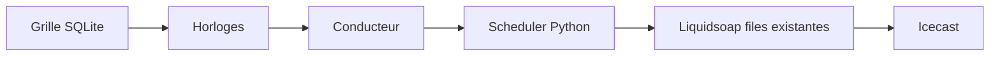

# Automate d’antenne BUTTON

Cahier des charges et décisions d’architecture. **Cible**, pas l’état du dépôt.

**Premier chantier :** l’automate customisable (motif, pubs à la minute, carts), **hors antenne** — [`automate-horloges.md`](automate-horloges.md). Ce fichier reste la spec **station** (live, relais, filets, overlay), pour plus tard.

| | |
|---|---|
| Statut | Cible — n’est pas la prod |
| Audience | Éditorial BUTTON et technique (Radiotomate, Labomedia) |
| Licence | AGPL-3.0-or-later, inchangée |
| Photo actuelle | [`architecture.md`](architecture.md), [`radiotomate/README.md`](../radiotomate/README.md) |
| Inventaire moteur | [`radiotomate-inventaire.md`](radiotomate-inventaire.md) |
| Live QG | [`live-qg.md`](live-qg.md) |
| Premier chantier | [`automate-horloges.md`](automate-horloges.md) · [`automate-horloges-plan.md`](automate-horloges-plan.md) |
| Feuille antenne | [`automate-plan.md`](automate-plan.md) — **en pause** |

Pas un cinquième produit à la racine. Pas un sprint : pas de schéma SQL, pas de routes d’interface, pas d’écrans. Ce document fige **quoi**, **jusqu’où**, et **comment ça s’accroche au moteur existant**.

---

## 1. Glossaire

| Terme | Sens ici |
|---|---|
| **Grille** | Calendrier des créneaux. Source de vérité de *quand* et *quoi*. Semaine type + overlay festival. |
| **Horloge** | Recette interne d’un créneau (jingles, ordre, durées). En v1 : paramètres du créneau, pas un atelier graphique. |
| **Conducteur** | Liste d’items d’antenne **matérialisée** à l’avance (fenêtre glissante). Ce qui *doit* sortir. |
| **As-run** | Ce qui *est* sorti. Déjà : `metadata_log`. Distinct du conducteur. |
| **Sync dure** | À l’heure dite on coupe et on enchaîne (ex. 20:00 plateau). |
| **Sync molle** | On finit le titre en cours, puis on enchaîne. |
| **Filet** | Ressource de secours **déclarée** sur le créneau si la ressource principale manque. Obligatoire. |
| **Overlay** | Créneaux d’édition (NTF#4) qui, sur leur plage, priment sur la grille semaine. |
| **Trafic** | Couche Python qui compile la grille en conducteur et parle à Liquidsoap. Pas le mixage. |

---

## 2. Problème et objectif

Radiotomate est un **lecteur prioritaire** : `live > relais > carts > auto-DJ`. Les files se remplissent quand elles se vident. L’ancienne grille NTF#4 (projet `festival/` retiré) décrit les types `live`, `relay`, `cart`, `autodj` : changer cette grille ne changeait rien au playout.

Deux vérités. Un producteur peut croire « 20:00 plateau » programmé. C’est vrai seulement si BUTT se connecte à 20:00.

**Objectif unique.** Un créneau écrit dans la grille est ce qui sort à l’antenne, y compris si le live ou le relais manque.

**Question-test (EF-01).** Tant que le logiciel ne peut pas y répondre, le projet n’est pas tenu :

> À 20:00, si le QG n’est pas connecté, qu’est-ce qui sort — et qui l’a décidé hier ?

---

## 3. Périmètre

### Dans le projet

Uniquement la **commande d’antenne**. Quatre types, déjà nommés dans la grille festival :

| Type | Ressource principale | Filet (obligatoire, à figer par créneau) |
|---|---|---|
| `autodj` | filtre Beets de l’horloge / créneau | élargir le filtre, puis tout `Music/` |
| `cart` | cart Radiotomate (id) | item suivant du conducteur, ou auto-DJ déclaré |
| `relay` | URL Icecast partenaire | cart, autre URL, ou auto-DJ déclaré |
| `live` | attente harbor `:6800` (rôle `stream`) | bed / cart / auto-DJ — **décidé hier** |

Inclus :

- grille semaine + overlay NTF#4 ;
- horloge (jingles calés, plus `delay(780.)`) ;
- conducteur fenêtre ≥ 30 min ;
- sync dure / molle ;
- filet par créneau ;
- as-run existant, non remplacé ;
- deux régimes, **même** moteur : 24/24 et semaine festival.

Dossiers **quand** on implémentera : `radiotomate/` (scheduler, modèles). Donnée de grille : **import** (jeton NTF#4), puis la base commande.

### Hors projet

Autre cahier, pas un élargissement furtif.

| Dossier | Rôle | Ici |
|---|---|---|
| [`player/`](../player/README.md) | auditeur, React | intouchable |
| [`ops/`](../ops/README.md) | Icecast, Caddy, banc | l’automate s’y branche, il ne le remplace pas |
| [`docs/archive/`](archive/README.md) | ancien Pi | hors prod |

On ne fait pas :

- réécrire l’admin en React / SPA, FastAPI, 5e dossier `console/` ;
- remplacer Radiotomate (LibreTime, Rivendell, mAirList, RadioDJ) ;
- recoder le playout en Python ; nouvelle file `conductor_queue` dans Liquidsoap ;
- horloges uniquement dans le `.liq` ;
- pupitre opérateur (Now / Next / Take live) ;
- réparer le crossfade ; ducking jingle ;
- mixette, GPIO, RDS, Arcom, nouveaux droits ;
- nouveaux ports publics, nouvel Icecast, nouveau `now.json` ;
- rebase Heptapod comme prérequis ;
- régie web obligatoire au QG — BUTT / LS vers `:6800` suffit ([`live-qg.md`](live-qg.md)).

Le harbor **reste** la préemption max. Ce projet dit quoi faire **quand il n’est pas là**.

### Frontières

```text
                    CE PROJET (trafic, dans radiotomate/)
                    grille SQLite → horloge → conducteur
                              │
player/  ──écoute──► Icecast ◄── Liquidsoap (graphe inchangé)
(ops + Labomedia)              files existantes
```

Les projets à la racine **restent distincts**. Fork `radiotomate` : un thème ne suffit plus dès que le trafic change ; l’étage reste dans `radiotomate/`.

### Contraintes d’exploitation

- VM Linux Labomedia, Podman. Playout **pas** sur macOS.
- Pi 3B : encodeur optionnel, jamais l’automate.
- Ports : 6811 interface, 6800 harbor, 6822 scheduler interne, 6833 API playout, 8443 Icecast. Ne pas exposer 6822/6833.
- Cookie session, origine `:6811`. Navigateur ↛ `:6822`.
- Médiathèque : MusicDropbox → Beets ([`comptes-et-medias.md`](comptes-et-medias.md)).
- Carts et rôles existants (`admin`, `carts`, `autodj`, `live`, `stream`) : on **pilote**, on ne réinvente pas.
- Une antenne, un mount Icecast.

### Acteurs

| Acteur | Décide | Ne décide pas |
|---|---|---|
| Éditorial BUTTON | grille, sync, filet | mixage, Icecast |
| Producteur distant | contenu de ses carts ; harbor s’il a `stream` | grille des autres |
| QG St Aignan | ouvrir/fermer BUTT | le filet si BUTT est down |
| Admin Labomedia / BUTTON | VM, YAML, comptes | programmation artistique |
| Auditeur | — | player hors projet |

La grille NTF#4 (ancien projet festival) est le **jeu de tests métier**, pas un autre planning.

---

## 4. Exigences fonctionnelles

| ID | Exigence |
|---|---|
| **EF-01** | Pour tout créneau `live`, le filet est défini avant l’antenne. QG absent à H ⇒ le filet sort. Pas du silence. Pas d’auto-DJ « par accident ». |
| **EF-02** | Une seule vérité de programmation : modifier un créneau (heures, type, ressource, filet, sync) change le conducteur. Pas deux calendriers (`grille.js` vs antenne). |
| **EF-03** | On peut lister au moins les **30 prochaines minutes** du conducteur (items, type, heure prévue, ressource). |
| **EF-04** | Créneau `relay`, flux mort ou stoppé ⇒ filet du créneau. |
| **EF-05** | Créneau `cart` vide ou illisible ⇒ filet du créneau. Pas d’antenne ouverte sur du vide. |
| **EF-06** | Encodeur autorisé qui se connecte **pendant** n’importe quel créneau prend l’antenne (préemption actuelle). |
| **EF-07** | Fin de harbor : retour au conducteur, pas reprise au milieu du titre coupé (skip actuel). |
| **EF-08** | Sync **dure** : à l’heure, skip + enchaînement. Sync **molle** : fin de titre puis enchaînement. Chaque créneau (ou item d’horloge) a une sync. |
| **EF-09** | Overlay festival : à T, le créneau overlay qui couvre T l’emporte sur la grille semaine. |
| **EF-10** | Régime 24/24 : une grille semaine minimale (un grand `autodj` + filet) suffit, sans humain en régie. |
| **EF-11** | Jingles poussés selon l’horloge du créneau, pas un délai magique ~13 min. |
| **EF-12** | As-run (`metadata_log`) continue d’enregistrer ce qui est sorti, distinct du conducteur. |
| **EF-13** | Après redémarrage scheduler / playout, reprise depuis le conducteur en base, pas un tirage Beets au hasard comme seule politique. |
| **EF-14** | Player public et Icecast : comportement d’écoute inchangé (titre via Now Playing / Icecast). |

---

## 5. Exigences non fonctionnelles

| ID | Exigence |
|---|---|
| **ENF-01** | Fuseau de saisie et d’affichage : `Europe/Paris`. Instants en base non ambigus (UTC). NTF#4 = CEST. |
| **ENF-02** | Fenêtre conducteur toujours ≥ 30 min d’items **prévus** ; cible 60 min. Recalcul si la grille change. |
| **ENF-03** | Look-ahead playout : 1–2 items dans les files Liquidsoap (modèle actuel). Pas du last-second uniquement. |
| **ENF-04** | Politique produit : pas de `blank()` comme filet. Le silence technique (trou, xrun) n’est pas une programmation. |
| **ENF-05** | Un seul planificateur de *quand*. Interdit : cron carts TIMED **et** grille en parallèle. |
| **ENF-06** | Le trafic parle au playout via l’API interne `:6833` déjà exposée. Pas d’API playout parallèle. |
| **ENF-07** | Disponibilité : même hôte et mêmes process Radiotomate (interface, scheduler, Liquidsoap). Pas de nouveau daemon public. |
| **ENF-08** | Licence et fork : patches BUTTON dans `radiotomate/`, AGPL. Pas de contournement par un binaire fermé. |

---

## 6. Architecture cible

```text
Grille SQLite (semaine + overlay)
        → horloges (paramètres de créneau)
                → conducteur matérialisé (fenêtre glissante)
                        → scheduler interprète 1–2 items
                                → API playout :6833 (files existantes)
                                        → fallback LS : LIVE > relais > carts > autodj > blank
                                                → Icecast Labomedia
```



Graphe **conceptuel** côté politique : `LIVE > CONDUCTEUR > FILETS`.  
Graphe **réel** Liquidsoap : inchangé. Le conducteur **alimente** relais / carts / autodj / jingles ; le filet est un autre item, pas une 5e source LS.

### Mapping vers Liquidsoap existant

[`radiotomate/playout/radiotomate.liq`](../radiotomate/playout/radiotomate.liq) — API `:6833` :

| Item conducteur | Action |
|---|---|
| `autodj` | `POST /queue/autodj` (piste issue du filtre Beets du créneau) |
| `cart` | `POST /queue/carts` |
| jingle (horloge) | `POST /queue/jingles` |
| `relay` | `POST /relay?url=…` ; **fin de créneau** : `DELETE /live?relay=1` (déjà utilisé pour couper le relais) |
| `live` | ne pas nourrir carts/autodj **sauf filet** ; si harbor connecte, `stream` gagne tout seul |
| filet | même table, ressource de secours du créneau |
| sync dure | `DELETE /live` (skip) puis pousser |
| sync molle | pousser en file, départ en fin de titre |

Créneau `live` sans encodeur : jouer le **filet** jusqu’à connexion harbor ou fin de créneau.

Constats moteur (pas des livrables) :

- `fallback([stream, relay, carts, autodj, blank()])`, `track_sensitive=false` ;
- jingles au-dessus des programmes : ils **coupent**, ils ne duckent pas — hors projet de changer ça ;
- crossfade 3 s commenté — hors projet ;
- aujourd’hui : files vides → [`scheduler/live.py`](../radiotomate/radiotomate/scheduler/live.py) ; cron carts → [`scheduler/schedule.py`](../radiotomate/radiotomate/scheduler/schedule.py).

---

## 7. Décisions d’architecture

Ne plus les rouvrir dans ce projet. Format : retenu / écarté / pourquoi.

### ADR-1 — Vérité runtime = SQLite Radiotomate

| | |
|---|---|
| **Retenu** | Grille, overlay, conducteur : même SQLite que carts, users, `autodj_slots`. |
| **Écarté** | L’ancienne grille NTF#4 comme calendrier runtime ; YAML git comme unique vérité live. |
| **Pourquoi** | Le scheduler a déjà la session DB et les FK vers les carts. Une vérité, reprise après crash (EF-13). Git peut porter un **jeton d’import** NTF#4 ; après import, la base commande. |

### ADR-2 — Liquidsoap quasi inchangé

| | |
|---|---|
| **Retenu** | Interpréter le conducteur vers `POST /queue/…`, `POST /relay`, `DELETE /live`. Jingles via `jingles_queue`, plus `delay(780.)` comme horloge. |
| **Écarté** | File `conductor_queue` ; réécriture du `fallback` ; horloges dans le `.liq`. |
| **Pourquoi** | Contrat playout déjà là, fork mince ([`README.md`](../radiotomate/README.md)). Python oriente, Liquidsoap mixe. Crossfade hors projet. |

### ADR-3 — Une seule grille

| | |
|---|---|
| **Retenu** | *Quand* = grille. *Quoi* = cart / filtre Beets / URL / attente harbor. `AutoDJSlot` et carts `ScheduleMode.TIMED` **fusionnent** dans cette grille (migration conceptuelle). |
| **Écarté** | Troisième calendrier à côté des crons et des slots auto-DJ. Deux planificateurs (ENF-05). |
| **Pourquoi** | Aujourd’hui deux « quand » pauvres. Un troisième empire le trou BUTTON. |

### ADR-4 — Fuseau `Europe/Paris`

| | |
|---|---|
| **Retenu** | Saisie / grille / NTF#4 en heure de Paris. Stockage d’instants en UTC. |
| **Écarté** | Naive datetime, heure machine, UTC affiché aux producteurs. |
| **Pourquoi** | ENF-01. Festival en CEST. Évite les créneaux décalés d’une heure. |

### ADR-5 — Overlay festival > semaine

| | |
|---|---|
| **Retenu** | À T : créneau overlay (ex. tag `ntf4`) qui couvre T, sinon créneau de la semaine type. |
| **Écarté** | Remplacer toute la semaine par une grille festival figée ; deux bases. |
| **Pourquoi** | EF-09, EF-10. Le 24/24 reprend dès que l’overlay se termine (ex. dim. 9, 18:00). |

### ADR-6 — Conducteur matérialisé

| | |
|---|---|
| **Retenu** | Items persistés : heure prévue, type, ressource, sync, statut (`prévu` / `en file` / `à l’antenne` / `joué` / `sauté` / `filet`). Fenêtre ≥ 30 min, cible 60. Recalcul si grille change. Look-ahead 1–2 dans LS. |
| **Écarté** | Conducteur purement calculé à la volée sans état ; se fier à « file vide ⇒ Beets ». |
| **Pourquoi** | EF-03, EF-13, ENF-02, ENF-03. On peut *lire* les 30 prochaines minutes. |

### ADR-7 — Filet = champ obligatoire

| | |
|---|---|
| **Retenu** | Chaque créneau : type de filet + cible (cart, filtre auto-DJ, bed). |
| **Écarté** | Auto-DJ implicite parce que la file était vide ; `blank()` comme politique (ENF-04). |
| **Pourquoi** | EF-01, EF-04, EF-05. C’est la question-test. |

### ADR-8 — Pas de SPA, pas de 5e dossier

| | |
|---|---|
| **Retenu** | Trafic dans `radiotomate/`. Éditeur éventuel = Quart `:6811` (hors livrable de ce cahier). |
| **Écarté** | Console React, FastAPI, dossier `console/`. Navigateur → `:6822`. |
| **Pourquoi** | Le levier est le conducteur, pas le skin. Player / ops hors projet (EF-14). |

---

## 8. Modèle d’information (conceptuel)

Pas un schéma SQL. Champs métier minima.

**Créneau de grille**

- identité, titre éditorial ;
- plage : début / fin (affichage Paris, instant UTC) ;
- portée : `semaine` (jour de semaine + minutes) **ou** `overlay` (date civile + heures, tag ex. `ntf4`) ;
- type : `autodj` \| `cart` \| `relay` \| `live` ;
- sync : `dure` \| `molle` ;
- ressource principale : id cart **ou** filtre Beets **ou** URL **ou** « attente harbor » ;
- filet : type + cible (obligatoire) ;
- horloge (v1) : ex. cart jingles + cadence ; vide = pas d’habillage extra.

**Item de conducteur**

- lien au créneau ;
- `prévu_à` (UTC) ;
- type d’item (y compris `jingle` issu de l’horloge, et `filet`) ;
- ressource résolue (chemin, URL, id) ;
- sync ;
- statut : `prévu` \| `en file` \| `à l’antenne` \| `joué` \| `sauté` \| `filet` ;
- durée estimée si connue.

**As-run** — table / log existant. Pas fusionné avec le conducteur.

---

## 9. Comportements

**Résolution à T.** Overlay couvrant T, sinon créneau semaine. Trous de grille interdits en 24/24 (au moins un `autodj` qui couvre).

**`autodj`.** Remplir `autodj_queue` avec des pistes du filtre du créneau. Filet si le filtre ne rend rien (déjà un fallback Beets « tout `Music/` » côté moteur — ici c’est **déclaré**).

**`cart`.** `next_sound()` du cart, `POST /queue/carts`. Vide / erreur fichier ⇒ filet.

**`relay`.** Au début (selon sync) : `POST /relay`. Pendant : si le relais meurt, filet. À la fin : `DELETE /live?relay=1` pour ne pas laisser le relais manger le créneau suivant.

**`live`.** Pendant le créneau : ne pas pousser de programme **sauf filet** tant que le harbor n’est pas là. Harbor connecté ⇒ préemption LS, inchangée. Harbor absent ⇒ filet jusqu’à connexion ou fin de créneau. Fin de live ⇒ skip / pas de reprise milieu de titre (EF-07).

**Jingles.** Items d’horloge → `POST /queue/jingles`. Ils coupent encore le programme (graphe actuel). On ne promet pas l’overlay mixé.

**Sync dure.** À l’heure : skip (`DELETE /live`) puis action du nouvel item.

**Sync molle.** Item en file ; départ quand le titre courant finit. Si l’heure de fin du créneau arrive avant, la politique du créneau suivant s’applique (dure = on coupe).

**Crash / restart.** Relire les items `prévu` / `en file` encore valides ; ne pas vider la politique au profit d’un random Beets (EF-13).

---

## 10. Critères d’acceptation

Le projet est **tenu** ssi tout est vrai. Hors sujet si on livre un skin, un autre automate, ou une SPA à la place.

| Critère | Exigences |
|---|---|
| 1. Un changement de créneau en base change l’antenne prévue, sans double calendrier `.liq` / `grille.js` | EF-02, ADR-1 |
| 2. Les 30 prochaines minutes sont listables | EF-03, ADR-6 |
| 3. `live` à H, harbor absent : filet prévu | EF-01, ADR-7 |
| 4. `relay` mort : filet prévu | EF-04 |
| 5. `cart` vide : filet prévu | EF-05 |
| 6. Harbor autorisé préempte tout créneau | EF-06 |
| 7. Fin de live : pas de reprise milieu de titre | EF-07 |
| 8. Sync dure et molle se comportent comme §9 | EF-08 |
| 9. Overlay NTF#4 prime sur la semaine ; après l’overlay, la semaine reprend | EF-09, EF-10, ADR-5 |
| 10. Player / Icecast inchangés | EF-14, ADR-8 |
| 11. Pas de 5e produit, pas de file LS nouvelle, pas de second planificateur | ADR-2, ADR-3, ADR-8, ENF-05 |

Jeu de scène pour 3–5 : grille NTF#4 déjà écrite (mer. 5, 20:00 QG ; jeu. 6, 18:00 relais RCO ; ven. 7, 17:00 Zef ; sam. 8, 18:00 P-Node).

---

## 11. Risques et non-objectifs

| Risque | Mitigation dans ce cahier |
|---|---|
| Filet non écrit par l’éditorial | [`automate-plan.md`](automate-plan.md) phase 0 : pas de code avant les filets NTF#4 |
| Deux calendriers pendant la migration | ADR-3, ENF-05 : un seul *quand* |
| Envie de « profiter » pour refaire l’UI | ADR-8, hors projet |
| Relais laissé `start` après le créneau | mapping `DELETE /live?relay=1` |
| Silence si tout est vide | ADR-7, ENF-04 ; 24/24 = `autodj` couvrant |
| Crossfade / coupe sèche | accepté, ticket audio séparé |
| Jingles qui coupent le titre | graphe actuel, pas de ducking |

Non-objectifs (rappel) : pupitre React, mixette, GPIO, Arcom, FastAPI, rebase amont, repair LS 2.3 transitions.

---

## 12. Préalable éditorial

Avant tout code : **filet de chaque créneau NTF#4**, en commençant par mercredi 5 mai 2027, 20:00–22:00, « QG St Aignan — plateau », encodeur `qg-st-aignan` absent.

Tableaux à remplir et phases suivantes : [`automate-plan.md`](automate-plan.md) (phase 0).

Tant que cette ligne n’est pas une décision éditoriale explicite, il n’y a rien à implémenter.
