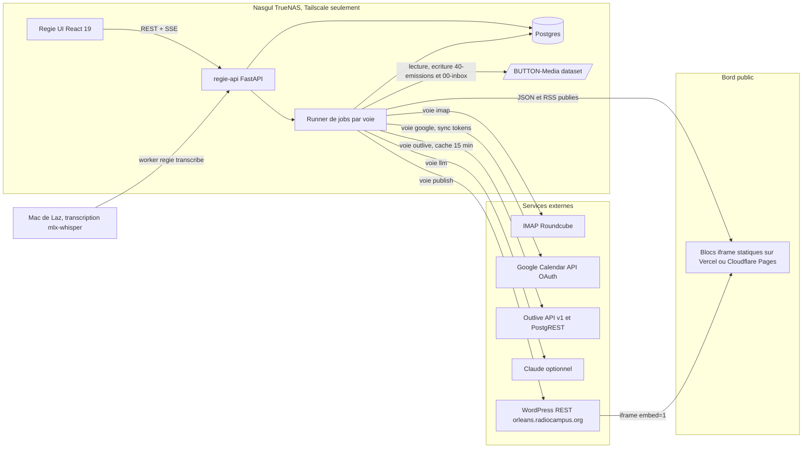
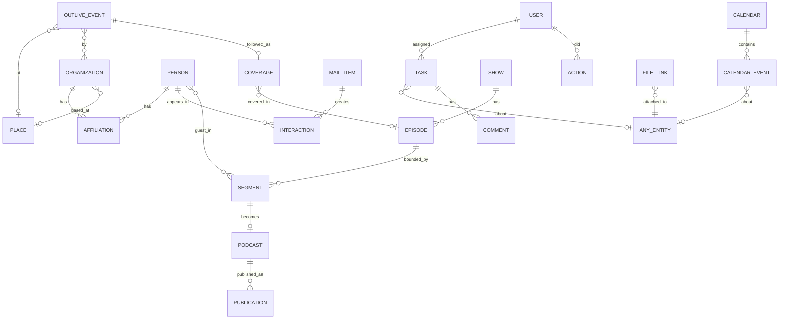
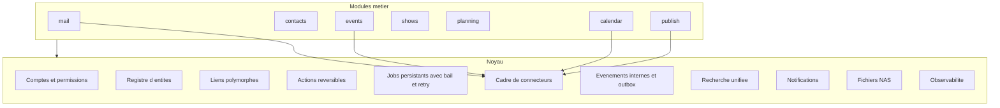

# Régie — le hub Radio Campus Orléans

Document de cadrage. Rédigé le 21/09/2026, à partir d’Inbox Zero v2 (en production sur Nasgul), de la médiathèque BUTTON, de la chaîne podcast, du projet Outlive et de vos deux agendas Google.

« Régie » est un nom de travail : la pièce d’où l’on pilote l’antenne. Il se change en une ligne dans `button/brand.json`.

---

## 1. La vision en une page

**Le problème.** Le travail de Radio Campus est éclaté : les mails dans Roundcube, les contacts dans Nextcloud, les tâches dans Vikunja et Notion, les événements dans Outlive, les fichiers sur le NAS, les émissions dans Reaper et un `bornes.json`, l’agenda dans deux Google Agenda. Rien n’est relié. Un dossier de presse reçu par mail ne « connaît » ni l’événement Outlive dont il parle, ni la personne qui l’envoie, ni l’interview qui en sortira, ni le podcast qui la valorisera.

**La promesse.** Un seul outil, chez vous, sur Nasgul, où chaque objet est relié aux autres : un mail mène au contact, le contact à sa structure et à ses événements, l’événement à l’émission qui le couvre, l’émission au podcast, le podcast au fichier sur le NAS et au bloc publié sur le site. Laz et Lou voient la même chose, en direct, et savent qui fait quoi.

**Cinq principes.**

- **Autonome.** Postgres, API et interface tournent sur Nasgul. Les dépendances externes sont celles que vous ne pouvez pas remplacer : IMAP Roundcube, Google Agenda (choix validé : synchro bidirectionnelle), Outlive (votre propre projet), le WordPress du site, Claude en option. Tout le reste est chez vous.
- **Une vérité par objet.** Les événements d’Orléans viennent d’Outlive et n’y sont jamais dupliqués à la main. Les contacts, tâches, émissions, podcasts vivent dans Régie. Les fichiers restent sur le NAS, Régie ne les déplace jamais sans demande.
- **Tout relié, rien ressaisi.** Un expéditeur devient une fiche contact en un clic. Un organisateur Outlive devient une structure. Un fichier `2026-09-11_hph_entiere.mp3` devient un épisode.
- **Collaboratif et réversible.** Comptes nominatifs, assignation, commentaires, présence en direct (SSE, déjà en place). Chaque action laisse une trace et s’annule, comme dans Inbox Zero.
- **Le design de la suite.** Noir, filets, accents live / ok / warn, microinteractions : le kit d’Inbox Zero v2 devient le kit de Régie.

---

## 2. Ce qui existe déjà et ce qu’on en garde

- **Inbox Zero v2** (`nasgul/inbox`, Nasgul `:30128`). FastAPI, SQLite, React 19, jobs à deux voies (IMAP / Claude), SSE, actions IMAP réversibles, recherche FTS, kit UI, store optimiste. **Devient le module « Mails » de Régie et fournit le socle technique** (runner de jobs, session IMAP, bus d’événements, kit de composants, design tokens).
- **Médiathèque BUTTON** (`docs/mediatheque.md`). Dataset `/mnt/data/media/button`, partage SMB `BUTTON-Media`, arbre `00-inbox/`, `10-rotation/`, `20-archives/`, `30-habillage/`, `40-emissions/`, `50-carts/`, `90-trash/`, catalogue Meilisearch `:30127`, Radiotomate en lecture. **Régie monte ce dataset en lecture, et en écriture sur les seuls dossiers convenus** (`40-emissions/`, `00-inbox/`).
- **Nextcloud** (`:30125`, Postgres 18 + Redis, carnet CardDAV `radiocampus`). **On importe le carnet une fois** dans Régie, puis Régie devient la source des contacts et republie un flux CardDAV en lecture pour les téléphones si besoin.
- **Vikunja** (`:30107`, sync iCal `nasgul/vikunja-ics`). **Retiré**, remplacé par le planning natif de Régie. Le script de sync iCal disparaît avec lui.
- **Notion** (Tâches « Programmé », projet Radio Campus, depuis Inbox Zero). **Gardé en export optionnel** : une tâche Régie peut être poussée dans Notion, mais Notion n’est plus une source.
- **Outlive** (Supabase + admin Next.js, `RESUME_PROJET_OUTLIVE.md`). Tables `events` (une ligne par occurrence), `locations`, `rooms`, `organizers`, `event_organizers`, `artists`, `categories`, `tags`, `cities`, `major_events` ; lecture anonyme sur les événements `approved` et `show_on_app`, API `GET /api/v1/events` et `GET /api/v1/radio-campus` (voit aussi les hors-app via service role), champ `agenda_types` avec la valeur `emission` prévue pour Radio Campus. **Source unique des événements d’Orléans**, lue et mise en cache par Régie.
- **Agenda iframe** (`RECAP_PROJET_IFRAME.md`, `radio-campus.vercel.app`). Vite/React, identité Labomedia, embed `?embed=1` avec `postMessage` hauteur / scroll, deux flux Outlive fusionnés (organisateur Radio Campus `9d6d803d…`, lieux Le Bouillon `33be1b27…` et Le 108 `7b353e08…`). **Premier bloc d’une famille de blocs publiables**, contrat d’embed à généraliser.
- **Chaîne podcast** (`RECAP_PODCASTS.md`). Master intact, transcription `.whisper` → `.json` de référence, `bornes.json` validé à la main, ReaScript régions, extraits ffmpeg, droits (musique exclue via `coupures`), deux portes Antenne / Archive. **Le modèle de données et le principe « le master ne se découpe jamais » sont repris tels quels** ; l’éditeur de bornes remplace la relecture du JSON à la main.
- **BUTTON** (`button/`, `player/`, `kiosk/`, `radiotomate/`, `ops/`). Brand, hub antenne `:30120`, player `radio.lazbutton.xyz`, kiosk Android, automate. **Plateforme partagée** : brand, tokens, NAS, Tailscale, secrets `~/.truenas-secrets/`.
- **Agendas Google.** `volontairemusique@` (Laz, ~130 événements : Turbulences, Le magazine culturel, Ouverture, Zéro Repos, ETF, valorisations, réunions, formations, RDV) et `volontairelocal@` (Lou et son prédécesseur Nicolas : jours à la radio, off, formations service civique, interviews, rendez-vous). Un agenda commun à créer côté Google. **Synchro bidirectionnelle** (décision validée).

---

## 3. Architecture cible

**Un seul backend, des modules.** `regie-api` reprend le code d’Inbox Zero (`jobs.py`, `imaputil.py`, `serialize.py`, kit UI) et l’organise en modules : `mail`, `contacts`, `events`, `shows`, `planning`, `calendar`, `files`, `publish`, `search`, `accounts`. Une seule base Postgres, un seul SSE, une seule palette ⌘K.

**Postgres.** Conteneur dédié `regie-pg` (Postgres 16 ou 18, dataset `/mnt/data/apps/regie/pg`) pour ne pas coupler Régie au Postgres de Nextcloud. Extensions : `unaccent`, `pg_trgm` (recherche), `pgcrypto`. Sauvegarde `pg_dump` quotidien vers le pool `backup` + snapshots ZFS.

**Voies de jobs.** `imap` (relevé, actions, pièces), `llm` (récaps, tri, résumés de podcast), `google` (synchro agendas), `outlive` (cache événements), `media` (ffmpeg : extraits, loudness, formes d’onde), `publish` (JSON statiques, RSS, WordPress). Priorités : action utilisateur en premier, tâches de fond ensuite, comme aujourd’hui.

**Pas d’entrée publique sur Nasgul.** Tailscale seulement, pas de Funnel. Ce qui doit être public (blocs iframe, flux RSS, JSON) est **publié** par Régie vers un hébergement statique (Vercel déjà utilisé, ou Cloudflare Pages). Le NAS pousse, personne ne tire.

**Transcription.** Nasgul n’a pas le CPU pour Whisper large. Options prévue : un petit worker sur le Mac (`regie transcribe`, tire les jobs `transcribe` par Tailscale, pousse le `.json`) ;

---

## 4. Modèle de données

### Comptes et traces

- `users` : nom, e-mail, mot de passe (argon2), rôle `admin | membre | invite`, passkey WebAuthn optionnelle, préférences (densité, notifications).
- `sessions`, `actions` (journal réversible, généralisé depuis Inbox Zero), `jobs`, `notifications` (in-app, Web Push auto-hébergé avec clés VAPID).

### Contacts

- `people` : nom, prénom, e-mails (plusieurs), téléphones, rôle affiché, notes, tags (`presse`, `label`, `artiste`, `institution`, `benevole`, `salarie`, `service-civique`), consentement / droit à la voix, `outlive_artist_id` optionnel, `carddav_uid` pour l’import Nextcloud.
- `organizations` : nom, type (`salle`, `label`, `festival`, `association`, `institution`, `media`, `agence`), site, réseaux, `outlive_organizer_id`, `outlive_location_id` si la structure est un lieu-organisateur.
- `places` : miroir des `locations` Outlive (`outlive_location_id`, nom, adresse, ville, salles), enrichi de notes internes (accès, contact régie, parking).
- `affiliations` : personne ↔ structure, rôle, dates.
- `interactions` : horodatées, typées (`mail`, `rdv`, `interview`, `podcast`, `evenement`, `note`), liées à la personne et à l’objet source (mail, épisode, événement de calendrier).

### Événements

- `outlive_events` : cache des événements Outlive (id, titre, date, fin, lieu, salle, organisateurs, artistes, catégorie, tags, image, URL externe, `agenda_types`, `status`, `show_on_app`), rafraîchi toutes les 15 min via l’API v1 (avec la clé partenaire pour voir les hors-app) et PostgREST anon en secours.
- `coverage` : suivi éditorial d’un événement par la radio : `a_couvrir`, `contact_pris`, `interview_prevue`, `enregistre`, `diffuse`, `podcast_publie`, `abandonne` ; responsable, émission cible, épisode lié, notes.
- `outlive_push` (option) : événements Radio Campus créés depuis Régie et poussés dans Outlive comme organisateur `9d6d803d…`, avec `agenda_types = ['emission']` quand c’est une émission spéciale.

### Émissions et podcasts

- `shows` : slug (`hph`, `etf`, `rco`, `turb`, `mag`…), nom, équipe (personnes), créneau, habillage, description, image, flux RSS activé ou non.
- `episodes` : émission, date, `master_path` (`40-emissions/{Show}/Entière/AAAA-MM-JJ_{show}_entiere.mp3`), durée, statut (`enregistre`, `transcrit`, `borne`, `monte`, `publie`), `transcript_path`, `bornes_path`, événements couverts, invités.
- `segments` : reprise de `bornes.json` : `in`, `out` en secondes, `phrase_in`, `phrase_out`, `handles`, `valide`, `confiance`, `note`, `coupures[]`, type (`itw`, `chro`, `live`, `debat`), invités (personnes), artiste ou sujet. Régie **écrit aussi** le `bornes.json` à côté du master pour que le ReaScript continue de fonctionner.
- `podcasts` : segment ou épisode entier, titre, description, image, `audio_path` généré (`extraits/`), loudness, droits vérifiés (musique retirée), statut.
- `publications` : où c’est parti (`rss`, `wordpress`, `notion`, `reseaux`), URL, date, identifiant distant.

### Planning

- `tasks` : titre, description, statut (`a_faire`, `en_cours`, `en_attente`, `fait`), assignés (plusieurs), échéance, priorité, objet lié polymorphe (`mail`, `person`, `organization`, `outlive_event`, `episode`, `podcast`, `calendar_event`), checklist, récurrence simple.
- `comments` : sur tâches, épisodes, contacts, événements ; mentions `@lou`.
- `calendars` : `google` (trois : Laz, Lou, commun) ou `regie` (grille de diffusion, échéances), propriétaire, couleur, `sync_token`, dernier passage.
- `calendar_events` : miroir local des événements Google (uid, début, fin, titre, description, lieu, participants, `etag`, `updated`), plus les événements natifs à pousser ; lien optionnel vers une tâche, un épisode, un événement Outlive, un contact.
- `availability` : jours off, télétravail, congés (dérivés des agendas ou saisis), pour la vue « qui est là ».

### Fichiers

- `file_links` : chemin NAS relatif au dataset, hash, taille, type, objet lié, rôle (`master`, `transcription`, `bornes`, `extrait`, `dossier_presse`, `visuel`, `contrat`). Régie ne stocke jamais les fichiers dans Postgres.

---

## 5. Les modules

### 5.1 Aujourd’hui (tableau de bord)

- En haut : la date, qui est là (Laz, Lou, disponibilités du jour), le prochain rendez-vous fusionné, la prochaine diffusion.
- Colonnes : mails à trier (compteur et trois premiers), tâches du jour par personne, événements de la semaine avec statut de couverture, podcasts en attente (transcrit mais pas borné, borné mais pas validé, prêt mais pas publié).
- Un fil « ce qui a changé » : actions de l’autre (Lou a validé les bornes de `hph`, a archivé douze newsletters), avec Annuler quand c’est possible.

### 5.2 Mails (Inbox Zero, intégré)

- Tout ce qui existe : tri Claude 30 jours, recherche sur toute la boîte, actions IMAP réversibles, récaps, Notion, pièces jointes.
- **Nouveau** : « Créer la fiche » depuis un expéditeur inconnu (pré-remplie : nom, e-mail, structure devinée depuis le domaine, signature analysée). Un expéditeur connu affiche sa fiche dans le rail droit : structure, derniers échanges, événements en cours, tâches ouvertes.
- **Nouveau** : « Faire une tâche » et « Couvrir cet événement » depuis un mail ; le mail devient l’objet lié. Les dossiers de presse (PDF) s’attachent à l’événement Outlive détecté par titre et date (proposition Claude, validation humaine).
- Migration du stockage SQLite vers Postgres, sans changer l’expérience.

### 5.3 Contacts, structures, lieux

- Fiche personne « 360 » : identité, structure(s), rôle, canaux, tags, consentements, **historique** (mails échangés, rendez-vous, interviews, podcasts où elle apparaît, événements où elle est artiste ou organisatrice), tâches ouvertes, fichiers liés.
- Fiche structure : personnes, événements Outlive à venir et passés (via `outlive_organizer_id`), lieu de base, conventions et partenariats (fichiers), notes.
- Fiche lieu : miroir Outlive + notes internes, programmation à venir, structures qui y jouent, contacts régie.
- Import initial du carnet CardDAV `radiocampus` (Nextcloud) et des expéditeurs fréquents d’Inbox Zero ; dédoublonnage par e-mail et par nom normalisé ; fusion en un clic.
- Export : vCard, CSV, flux CardDAV lecture seule pour les téléphones.
- Recherche instantanée dans la palette ⌘K : taper un nom ouvre la fiche, taper un domaine liste la structure.

### 5.4 Événements (Outlive)

- Vue agenda et liste des événements d’Orléans, filtres : à couvrir, Radio Campus, Le Bouillon, Le 108, par catégorie, par structure suivie.
- **Couverture** : chaque événement a un statut éditorial, un responsable, une émission cible, des tâches générées automatiquement (« demander une interview », « préparer les questions », « caler le studio », « valoriser le podcast »).
- Liens automatiques : organisateur Outlive → structure Régie, lieu → lieu, artistes → personnes. Les liens manquants se créent en un clic.
- **Vers Outlive** : proposer un événement Radio Campus (Apéraudio, émission spéciale, enregistrement public) via l’API partenaire, avec `agenda_types = ['emission']` ; l’agenda iframe du site le montre aussitôt.
- Un événement suivi apparaît dans l’agenda commun Google (choix par événement) et dans la vue Semaine de Régie.

### 5.5 Émissions et podcasts

- **Grille** : émissions, créneaux, équipes, habillage ; vue « saison » et « semaine », remplacements et absences visibles.
- **Épisodes** : détection automatique des masters déposés dans `40-emissions/{Show}/Entière/` (nommage `AAAA-MM-JJ_{show}_entiere.mp3`), création de l’épisode, lecture de la durée (`ffprobe`), forme d’onde calculée en tâche de fond.
- **Transcription** : bouton « Transcrire » → job `transcribe` pris par le worker Mac (mlx-whisper large-v3-turbo, `--word-timestamps`, `--condition-on-previous-text False`, `--initial-prompt` construit depuis le nom de l’émission et la programmation du jour) ou par le NAS pour les formats courts. Le `.json` est déposé à côté du master ; une seule passe fait foi.
- **Éditeur de bornes** : forme d’onde + transcription synchronisée ; clic sur une phrase = borne ; vérification d’unicité de la phrase ; locuteurs ; détection des trous de parole (seuils réglables : 20 s, fusion 30 s) surlignés comme blocs musicaux probables ; `coupures` posées à la souris ; `handles` par émission ; `valide` par séquence. Claude propose les séquences (phrases exactes, jamais de timecodes) et l’humain valide. Écriture du `bornes.json` compatible ReaScript.
- **Montage et export** : job `media` : extraction ffmpeg avec marges, retrait des `coupures`, normalisation loudness (EBU R128, cible podcast), export MP3 + WAV, fichier dans `extraits/` puis, sur demande explicite, porte **Antenne** (podcast classé) ou **Archive** (transcriptions et bornes). Reaper reste possible : le ReaScript lit le même `bornes.json`.
- **Fiche podcast** : titre, description (proposition Claude depuis la transcription, relecture humaine), invités (contacts), événement lié, image, mentions de droits (musique retirée ou autorisée).
- **Publication** : flux RSS par émission (auto-hébergé sur le bord public), article WordPress via l’API REST du site (brouillon puis publication), export Notion optionnel. Un podcast publié remonte dans le bloc « Derniers podcasts » du site.

### 5.6 Planning et collaboration (Laz + Lou)

- **Tâches** : liste et kanban par personne, par émission, par événement ; assignation multiple, échéance, priorité, checklist, commentaires avec mentions, pièces et liens vers n’importe quel objet. Tout objet de Régie a un onglet « Tâches ».
- **Vue Semaine** : fusion des trois agendas Google (couleur par agenda), diffusions (grille), événements Outlive suivis, échéances de tâches, disponibilités (Lou off, télétravail). Filtres par personne. Glisser-déposer pour déplacer un événement ou une échéance.
- **Google Agenda, bidirectionnel** : OAuth (projet Google Cloud, écran de consentement interne, type « application de bureau » ou web avec redirection Tailscale), un jeton par compte Google ; lecture incrémentale par `syncToken` toutes les 60 s (pas de webhook, Nasgul n’est pas public) ; écriture : créer, modifier, déplacer un événement dans l’agenda choisi ; règle de conflit « la dernière modification gagne, l’autre version est gardée dans l’historique » ; suppression côté Régie = suppression Google confirmée. Les rendez-vous créés depuis un contact ou un événement Outlive portent le lien dans la description.
- **Où on en est** : compteurs par semaine (mails traités, événements couverts, podcasts publiés, tâches faites), objectifs de saison, rétro hebdomadaire générée (Claude résume les actions de la semaine, relecture avant partage).
- **Notifications** : in-app (SSE, déjà là), Web Push auto-hébergé (VAPID) sur mobile, résumé du matin dans le tableau de bord. Jamais d’e-mail sortant.

### 5.7 Fichiers (NAS)

- Explorateur limité aux dossiers de la médiathèque, avec les rôles : `00-inbox/` (dépôt), `40-emissions/` (masters, transcriptions, bornes, extraits), `20-archives/`, `30-habillage/`. Aperçu audio (forme d’onde), PDF, images.
- Liaison fichier ↔ objet (épisode, podcast, contact, structure, événement) sans déplacer le fichier. Régie ne renomme jamais un master.
- Le catalogue Meilisearch `:30127` reste pour la musique ; Régie indexe ses propres fichiers dans Postgres (chemin, nom, tags, transcriptions).
- Conventions de nommage affichées et vérifiées à l’écran : `AAAA-MM-JJ_{show}_entiere.mp3`, `…_itw_{slug}`.

### 5.8 Publier (site et iframes)

- **Famille de blocs** sur le même contrat que l’agenda existant (`?embed=1`, `postMessage` hauteur et scroll, `target=_top`, identité Labomedia) : Agenda (existant, à rapatrier dans ce projet), Prochainement à l’antenne (grille + événements couverts), Derniers podcasts (depuis les RSS Régie), Playlist de la semaine (depuis le catalogue ou Radiotomate), Équipe et contact (personnes publiques).
- **Données** : Régie publie des JSON et des RSS statiques vers le bord public à chaque changement (job `publish`) ; les blocs lisent ces fichiers et l’API Outlive. Aucun accès du public à Nasgul.
- **WordPress** : article de podcast créé en brouillon par l’API REST, avec le lecteur audio et le lien RSS ; snippet d’embed généré pour chaque bloc.

### 5.9 Recherche globale

- Une seule boîte ⌘K : mails, contacts, structures, lieux, événements, épisodes, podcasts, transcriptions, fichiers, tâches. Postgres `tsvector` + `unaccent` + `pg_trgm`, classement par type et récence, aperçu à droite, actions contextuelles (ouvrir, créer une tâche, couvrir).

### 5.10 Réglages et administration

- Comptes et rôles, connexions (IMAP, Google par personne, Outlive, WordPress, Notion, Claude), dossiers NAS autorisés, journal d’actions, état des jobs et des synchros, sauvegardes (dernier `pg_dump`, dernier snapshot), export complet (JSON + fichiers) pour ne jamais être prisonnier de l’outil.

---

## 6. Besoins imaginés pour Radio Campus

Tirés de vos agendas, de vos mails et de la vie d’une radio associative. Chacun est un petit module ou une simple vue, sur le même modèle.

- **Conducteur d’émission** : feuille de route par épisode (séquences prévues, invités, titres à passer, jingles), imprimable, partagée avec l’équipe de l’émission, transformée après diffusion en base pour les bornes.
- **Invités** : fiche invité liée au contact, formulaire d’autorisation (voix, image, diffusion podcast) signé sur tablette ou par lien, rappel automatique la veille, attestation de passage à l’antenne générée en PDF (une tâche « Relancer attestation de passage à l’antenne » existe déjà dans ton agenda).
- **Service civique et bénévoles** : suivi des volontaires (Lucas, Nico, Lou) : heures, formations obligatoires (formation civique et citoyenne, PSC1), bilans, récupérations, avec les échéances dans l’agenda commun. Le mail de la DRAJES « Programmes formations » devient une tâche liée.
- **Réservation studio et matériel** : Studio 2, enregistreurs, micros ; prêt à des associations (« Prêt matériel asso les survenus ») avec date de retour et contact ; conflits visibles dans la vue Semaine.
- **Pipeline « idée invitée »** : les mails de Viviane et Erwann marqués « idée invité » deviennent des cartes dans un tableau « Idées → Contact pris → Programmé → Enregistré → Diffusé → Valorisé », reliées à l’événement Outlive et au podcast.
- **Valorisation** : pour chaque podcast, une liste de sorties (site, réseaux, newsletter, Outlive si événement, partenaires) avec cases à cocher, textes proposés par Claude à partir de la description, visuels générés depuis un gabarit Labomedia.
- **Revue de presse et partenariats** : dossiers de presse reçus classés par événement et structure ; conventions et partenariats (Crous, 108, Bouillon, Frac) avec échéances de renouvellement.
- **Antenne et écoute** : le hub BUTTON connaît le flux et le now playing ; Régie affiche les auditeurs Icecast par émission et par podcast téléchargé, pour savoir ce qui marche.
- **Playlists et programmation musicale** : lien entre le catalogue Meilisearch, les playlists de la semaine et les émissions ; les nouveautés reçues par mail (labels, agences) deviennent des « à écouter » assignés, avec le mail et la pièce audio liés.
- **Mémoire de la radio** : la recherche sur les transcriptions rend tout le fond parlé consultable : qui a dit quoi, quand, dans quelle émission.

---

## 7. Choix techniques et dépendances

### Ce qu’on utilise

- **Postgres 16 ou 18** en conteneur dédié, extensions `unaccent`, `pg_trgm`, `pgcrypto`. Migrations versionnées (Alembic ou SQL numérotées comme Outlive).
- **FastAPI** + `asyncpg` (ou SQLAlchemy 2 async), Pydantic. Reprise de `jobs.py` (voies et priorités), `imaputil.py`, `sanitize.py`, `serialize.py`, SSE.
- **React 19 + Vite + TypeScript**, kit et tokens d’Inbox Zero v2, `react-router`, aucun framework UI. Forme d’onde : Canvas maison (déjà fait pour l’oscilloscope BUTTON) ou `wavesurfer.js` si le temps manque.
- **Recherche** : Postgres FTS. **Médias** : `ffmpeg`, `ffprobe`, `mlx-whisper` (Mac) ou `faster-whisper` (NAS). **Flux** : `feedgen` (RSS), `icalendar`. **Google** : `google-api-python-client` + `google-auth-oauthlib`. **Contacts** : `vobject` (vCard), serveur CardDAV lecture seule minimal. **Auth** : sessions, `argon2-cffi`, `webauthn` en option. **Push** : `pywebpush`.
- **Bord public** : Vercel (déjà en place pour l’agenda) ou Cloudflare Pages ; déploiement statique déclenché par le job `publish`.

### Ce qu’on évite

- Vikunja, Notion comme source, Nextcloud Contacts comme source, Supabase pour les données radio, Funnel ou tout port public sur Nasgul, l’envoi d’e-mails.
- Toute bibliothèque de composants, tout ORM lourd, toute file de messages externe : Postgres et un runner de jobs suffisent à deux personnes.

### Dépendances externes assumées

- IMAP Roundcube (lecture, drapeaux, déplacements réversibles).
- Google Calendar API (choix validé ; jetons OAuth chiffrés dans Postgres, projet Google Cloud à créer, écran de consentement « interne » ou « test » pour deux comptes).
- Outlive (votre projet : API v1 et PostgREST anon ; une clé partenaire pour les hors-app).
- WordPress `orleans.radiocampus.org` (API REST, un compte applicatif).
- Claude (optionnel, dégradation propre sans clé).
- Vercel ou Cloudflare Pages pour les blocs publics.

---

## 7 bis. Ingénierie : un noyau, des modules, des connecteurs

Ce chapitre décrit ce qui rend Régie robuste aujourd’hui et extensible dans trois ans, quand l’équipe aura changé et que de nouveaux besoins seront apparus. La règle : **ajouter un module ou une intégration ne doit jamais demander de toucher au noyau.**

### Principes d’ingénierie

- **Monolithe modulaire.** Un seul processus, un seul déploiement, mais des modules étanches (`mail`, `contacts`, `events`, `shows`, `planning`, `calendar`, `files`, `publish`) qui ne s’appellent qu’à travers le noyau. Découper plus tard en services reste possible, ce n’est pas nécessaire pour deux personnes.
- **Le noyau ne connaît aucun métier.** Il fournit : comptes et permissions, registre d’entités, liens, actions réversibles, jobs, connecteurs, événements internes, recherche, notifications, fichiers, observabilité.
- **Tout ce qui sort est idempotent et rejouable.** Chaque écriture externe (IMAP, Google, WordPress, Outlive) porte une clé d’idempotence et se rejoue sans doublon.
- **Les contrats sont typés et générés.** OpenAPI côté API, types TypeScript générés pour l’interface : le front ne peut pas dériver du back.
- **Dégradation propre.** Chaque intégration peut tomber sans emporter le reste : Régie affiche l’état, garde les données locales, reprend seule.
- **Réversible par défaut.** Toute action métier passe par le journal d’actions et sait s’annuler ; ce qui ne peut pas s’annuler (publication publique) demande une confirmation explicite.
- **Une décision, un ADR.** Les choix d’architecture sont consignés dans `docs/adr/NNN-titre.md` (contexte, décision, conséquences), pour que le prochain contributeur comprenne pourquoi.

### Le noyau

**Registre d’entités.** Chaque type métier (`mail_item`, `person`, `organization`, `place`, `outlive_event`, `show`, `episode`, `segment`, `podcast`, `task`, `calendar_event`, `file`) se déclare au noyau avec : son nom, son libellé, sa table, comment le résumer (titre, sous-titre, icône, chip), comment l’indexer (texte, poids), quelles actions il accepte, comment le sérialiser. Le front possède le même registre : une entité inconnue s’affiche quand même (titre + lien), une entité connue a sa carte et sa page. **Ajouter un type = un fichier côté API, un fichier côté UI.**

**Liens.** Une table `links(src_kind, src_id, dst_kind, dst_id, role, created_by, created_at)` porte toutes les relations transverses (mail → contact, événement → épisode, tâche → n’importe quoi, fichier → n’importe quoi). Les relations internes à un module restent des clés étrangères classiques. Suppression d’une entité = les liens partent avec elle (gestionnaire par type), jamais de lien orphelin.

**Actions réversibles.** Généralisation du journal d’Inbox Zero : `actions(kind, entity_kind, entity_ids, before, after, status, undone_at, actor)`. Chaque module déclare ses actions avec `apply`, `revert`, `label`, `needs_confirmation`. Le noyau offre l’annulation, l’historique, le `z`, et le fil « ce qui a changé » du tableau de bord.

**Jobs persistants.** Version 2 du runner : file en Postgres (`jobs` avec `lane`, `priority`, `run_at`, `attempts`, `lease_until`, `idempotency_key`, `payload`, `result`, `error`), prise par bail (`SELECT … FOR UPDATE SKIP LOCKED`) pour permettre plusieurs travailleurs (le Mac de transcription en est un), reprise après redémarrage, retentatives à délai croissant, file des échecs définitifs visible dans Réglages, planification récurrente (`schedules` : relevé toutes les 3 min, Outlive toutes les 15 min, sauvegarde à 4 h). Les voies (`imap`, `llm`, `google`, `outlive`, `media`, `publish`, `transcribe`) gardent un seul travailleur là où l’ordre compte (IMAP), plusieurs ailleurs.

**Événements internes et outbox.** Une écriture métier émet un événement (`podcast.published`, `coverage.changed`, `contact.merged`) dans une table `outbox` en même transaction ; un relais les livre au SSE, aux notifications, aux connecteurs sortants et aux recherches à réindexer. Rien ne se perd si le processus tombe entre l’écriture et la livraison.

**Recherche unifiée.** Une table `search_documents(kind, id, title, body, tsv, updated_at)` alimentée par le registre à chaque changement ; `unaccent` + `pg_trgm` ; classement par type, récence et pertinence ; un seul point d’entrée pour la palette ⌘K et les recherches de module.

**Notifications.** `notifications(user, kind, entity, text, read_at)` + Web Push VAPID + SSE ; les règles (« quand Lou m’assigne », « quand un podcast attend ma validation ») se règlent par utilisateur.

**Fichiers.** Accès au NAS par un service unique : chemins relatifs au dataset, liste blanche de dossiers en écriture, hachage et taille, aperçus générés en tâche de fond, aucune écriture hors des dossiers déclarés, jamais de suppression (corbeille `90-trash/`).

**Observabilité.** Journaux structurés (JSON, un identifiant de requête et de job), métriques exposées sur `/api/metrics` (files, durées, erreurs par connecteur, fraîcheur des synchros), `/health` détaillé pour la supervision TrueNAS, page « État du système » dans Réglages.

### Le cadre de connecteurs

Toutes les intégrations suivent la même interface, ce qui rend la prochaine (Instagram, Mastodon, un autre agenda, un autre webmail) prévisible :

- `pull(cursor) → changements, nouveau cursor` : lecture incrémentale (Google `syncToken`, IMAP `UIDNEXT` et `CONDSTORE` si disponible, Outlive `updated_at`, WordPress `modified_after`).
- `push(change) → external_ref` : écriture idempotente, avec `external_refs(system, kind, id, external_id, etag, version, synced_at, last_error)` pour ne jamais recréer ce qui existe.
- `map(externe) ↔ interne` : mappage explicite et testé.
- `health()` : état, dernier succès, dernier échec, quota.
- Politique de conflit déclarée par connecteur (Google : dernière modification gagne, version précédente conservée dans l’historique de l’entité ; Outlive : lecture seule sauf événements Radio Campus ; IMAP : Roundcube fait foi pour lu / non lu).
- Coupe-circuit : après N échecs consécutifs, le connecteur passe en pause avec alerte et reprise progressive.
- Chaque connecteur a un **faux jumeau** (comme `FakeSession` pour IMAP) utilisé dans les tests et en mode démo.

### Fiabilité

- **Sauvegardes** : `pg_dump` quotidien chiffré vers le pool `backup`, snapshots ZFS horaires du dataset `regie`, conservation 30 jours ; **exercice de restauration** chaque trimestre sur le Mac (`docker compose --profile restore`). Un déploiement se refuse si la dernière sauvegarde a plus de 48 h.
- **Migrations** : Alembic, une migration par changement, toujours compatibles avec la version précédente du code (ajout puis bascule puis nettoyage), exécutées avant le démarrage de l’API, avec sauvegarde automatique juste avant.
- **Déploiement** : image versionnée par date et commit, l’image précédente conservée, `deploy.sh` enchaîne sauvegarde → migration → démarrage → tests de fumée (`/health`, connexion, une lecture par module) → bascule, et revient en arrière seul si la fumée échoue.
- **Reprise** : les jobs en cours au redémarrage reprennent (bail expiré) ; les actions optimistes non confirmées sont reconciliées au premier `/api/queue`.
- **Interface** : SSE avec `Last-Event-ID` et rejeu, réconciliation périodique par ETag, file d’attente locale des actions si la connexion Tailscale tombe, bannière « hors ligne » claire.
- **Limites** : quotas par utilisateur sur les appels Claude, taille maximale des pièces jointes et des exports, délais sur chaque connecteur, garde-fou de 20 événements modifiés par passe Google avant demande de confirmation (protège contre un effacement en masse).

### Sécurité et données personnelles

- Comptes nominatifs, mots de passe `argon2id`, passkeys WebAuthn en option, sessions serveur avec expiration, limitation des essais, CSRF sur les écritures, en-têtes de sécurité (CSP stricte, `frame-ancestors 'none'` pour Régie ; les blocs publics ont leur propre CSP).
- Permissions par rôle et par module (`admin`, `membre`, `invité` ; un invité voit une émission sans voir les mails), matrice documentée et testée.
- Secrets : jamais dans le dépôt, jamais dans la base en clair ; jetons OAuth chiffrés (clé dans `~/.truenas-secrets/`), rotation possible, journal des accès aux intégrations.
- Données personnelles : registre des traitements (contacts, invités, volontaires), durées de conservation (interactions mails : 3 ans ; invités : durée du consentement), export et effacement d’une personne en un clic, anonymisation des journaux au-delà de 90 jours.
- Sortie publique : seuls les JSON et RSS publiés quittent Nasgul ; aucun identifiant interne, aucune donnée de contact non marquée « publique ».

### Tests et qualité

- **API** : `pytest` avec faux connecteurs pour chaque intégration (IMAP déjà fait ; Google, Outlive, WordPress, CardDAV à écrire), tests de migration (base d’hier → aujourd’hui), tests de permissions (matrice complète), tests de propriété sur les bornes (aucun extrait ne sort des limites du master, les coupures sont respectées).
- **Interface** : `tsc` strict, `vitest` sur le store et les hooks, Playwright sur cinq parcours (connexion, trier un mail, créer une fiche depuis un mail, créer une tâche liée, valider des bornes).
- **Médias** : jeux d’essai audio courts, comparaison au niveau de l’échantillon des extraits ffmpeg, mesure loudness contrôlée.
- **Intégration** : un `docker compose --profile ci` monte Postgres + API + faux connecteurs et rejoue les parcours ; exécuté avant chaque déploiement.
- **Données** : validation Pydantic aux frontières, contraintes en base (clés étrangères, `CHECK`, unicité), jamais de logique métier dans l’interface seule.

### Extensibilité : ce qui est prévu sans être construit

- Nouveaux types d’entités (invité, réservation, matériel, partenariat) : par le registre, sans toucher au noyau.
- Nouveaux connecteurs (Instagram pour la valorisation, Mastodon, un CardDAV externe, un second webmail, Icecast statistiques) : par le cadre de connecteurs.
- Nouveaux travailleurs (un deuxième Mac pour transcrire, un GPU ponctuel) : par le bail des jobs, sans changement de code.
- Nouvelles surfaces (application mobile légère, PWA hors ligne, commandes vocales en régie) : par l’API versionnée `/api/v1` et l’OpenAPI.
- Nouvelles équipes (une autre radio du réseau Campus, une association partenaire) : par les scopes de permission ; le multi-organisation reste possible sans refonte car toutes les tables portent déjà `org_id` (une seule valeur au départ).
- Nouvelles langues : chaînes centralisées, français seul au départ.
- Changement d’hébergement : `docker compose up` avec une sauvegarde et le dataset suffit à repartir ailleurs ; aucune dépendance à TrueNAS dans le code.

### Décisions d’architecture à consigner dès la Phase 0

- ADR-001 Monolithe modulaire FastAPI + Postgres sur Nasgul.
- ADR-002 Outlive source unique des événements, cache local, écriture limitée aux événements Radio Campus.
- ADR-003 Google Agenda bidirectionnel par polling `syncToken`, conflits « dernière modification gagne » avec historique.
- ADR-004 Liens polymorphes et registre d’entités plutôt que clés étrangères transverses.
- ADR-005 Jobs persistants avec bail, plusieurs travailleurs possibles.
- ADR-006 Aucune entrée publique sur Nasgul, publication statique vers un bord public.
- ADR-007 Jamais d’envoi d’e-mail depuis Régie.

---

## 8. Séparer les projets

Le dépôt `RC_WEB_RADIO` mélange aujourd’hui la webradio BUTTON (New Trad Fest), les outils Radio Campus, les runbooks Nasgul et les secrets (ignorés par git, vérifié). Proposition, à faire au moment où Régie naît :

- `button/` reste la plateforme et l’antenne : brand, theme, hub `:30120`, player, kiosk Android, ops, radiotomate. Public, orienté auditeurs.
- `regie/` (nouveau dossier, ou nouveau dépôt) : Régie, avec Inbox Zero absorbé comme module. Privé, orienté équipe.
- `rco-site/` : les blocs publiables du site Radio Campus, dont l’agenda iframe rapatrié depuis son dépôt actuel. Public, identité Labomedia, déployé sur le bord public.
- `nasgul/` : runbooks, compose, scripts de déploiement, template de secrets. Le dossier `secrets/` reste hors git ; les valeurs vivent dans `~/.truenas-secrets/` et dans le gestionnaire de mots de passe.
- Le `brand.json` reste la source unique des noms et URL ; Régie y ajoute son entrée `labels.regie` et `apps.regie`.

---

## 9. Feuille de route

Chaque phase livre quelque chose d’utilisable par Laz et Lou dès le lendemain, et chaque phase a une **définition de « fini »** : tests verts, migration réversible, sauvegarde vérifiée, ADR à jour, parcours Playwright de la phase, documentation du module.

- **Phase 0 — Noyau** : Postgres dédié sur Nasgul, `regie-api` avec comptes et permissions, registre d’entités, liens, actions réversibles généralisées, jobs persistants avec bail, cadre de connecteurs et `external_refs`, outbox et SSE, recherche unifiée, notifications, service fichiers, observabilité, sauvegardes et exercice de restauration, `deploy.sh` avec fumée et retour arrière, CI, ADR-001 à 007. Inbox Zero migré vers Postgres et intégré comme module « Mails » sur ces contrats (premier client du noyau, preuve que l’abstraction tient). Critère : Inbox Zero fonctionne à l’identique dans Régie, Laz et Lou ont chacun un compte, une restauration depuis la sauvegarde de la veille réussit sur le Mac.
- **Phase 1 — Contacts et événements** : import CardDAV et expéditeurs, fiches personne / structure / lieu, cache Outlive et liens automatiques, « Créer la fiche » et « Couvrir » depuis un mail, statut de couverture. Critère : un dossier de presse reçu se retrouve relié à son événement et à son émetteur en trois clics.
- **Phase 2 — Planning et Google Agenda** : tâches, commentaires, vue Semaine, OAuth Google, synchro bidirectionnelle des trois agendas, disponibilités, tableau de bord Aujourd’hui, Web Push. Vikunja arrêté. Critère : un rendez-vous créé dans Régie apparaît dans Google en moins d’une minute, et inversement.
- **Phase 3 — Émissions et podcasts** : grille, épisodes détectés sur le NAS, worker de transcription, éditeur de bornes, export ffmpeg, fiche podcast, `bornes.json` compatible ReaScript. Critère : `hph` du 11/09 passe de la transcription au podcast exporté sans ouvrir le JSON à la main.
- **Phase 4 — Publier** : RSS par émission, blocs iframe (Podcasts, Prochainement, Agenda rapatrié), publication WordPress, job `publish` vers le bord public. Critère : un podcast publié depuis Régie est visible sur le site dans les cinq minutes.
- **Phase 5 — Vie de la radio** : conducteur, invités et autorisations, service civique, réservations, pipeline idée invitée, valorisation, statistiques d’écoute. Au fil de l’eau, par ordre de douleur.
- **Phase 6 — Séparation des dépôts et documentation** : `button/`, `regie/`, `rco-site/`, `nasgul/`, README par projet, guide « ajouter un module », guide « ajouter un connecteur », export complet, passation.

**Transversal, à chaque phase.** Une revue de sécurité (permissions du nouveau module, données personnelles touchées), une mesure de performance (temps de réponse `/api/queue` et recherche sous 150 ms, jobs sans retard), une mise à jour du registre des traitements, un ADR si un choix structurant a été fait.

---

## 10. Risques et garde-fous

- **Droits musicaux** : un podcast ne repart jamais avec les morceaux diffusés sans autorisation. Les `coupures` sont obligatoires avant publication ; la fiche podcast bloque la publication si la case « droits vérifiés » n’est pas cochée.
- **Données personnelles** : les contacts sont des données personnelles ; accès par compte, export et suppression sur demande, pas de partage hors de l’équipe, consentement tracé pour les invités.
- **Google** : quotas larges pour deux comptes ; l’application OAuth reste en mode « test » (jusqu’à 100 utilisateurs) ou « interne » si le domaine est Google Workspace ; les jetons sont chiffrés au repos ; en cas de perte de jeton, Régie continue en lecture des ICS.
- **IMAP** : mêmes garde-fous qu’Inbox Zero : PEEK, pas de suppression, MOVE + UIDPLUS, annulation, journal.
- **Un seul NAS** : sauvegardes `pg_dump` sur le pool `backup`, snapshots ZFS, export JSON complet ; un `docker compose up` sur une autre machine doit suffire à repartir.
- **Transcription** : coûteuse en CPU ; le Mac reste le chemin principal, le NAS ne fait que les formats courts. Une seule passe par émission fait foi.
- **Deux personnes, un outil** : chaque phase doit rester utile seule ; si une phase déçoit, on s’arrête là sans casser le reste.
- **Départ d’une personne** : comptes nominatifs désactivables, jetons Google révocables par compte, documentation par module et ADR : la connaissance est dans le dépôt, pas dans une tête.
- **Dérive du schéma Outlive** : le mappage Outlive → Régie est testé contre un échantillon figé ; un champ inconnu est ignoré et signalé, jamais bloquant.
- **Écriture Google en masse par erreur** : garde-fou de 20 modifications par passe, journal détaillé, historique des versions, annulation.
- **Perte du bord public** : les blocs se régénèrent depuis Régie à tout moment ; le site WordPress garde ses articles.
- **Charge des jobs** : voies séparées, priorités, bail ; un job bloqué expire et repasse en file ; alerte au-delà de dix minutes de retard.

---

## 11. Décisions

**Prises.** Vérité des données sur Nasgul (Postgres dédié) ; Outlive source unique des événements ; Google Agenda en synchro bidirectionnelle OAuth ; Vikunja retiré ; Notion en export optionnel ; pas d’envoi d’e-mail ; pas d’entrée publique sur Nasgul, blocs publiés vers un bord statique ; design de la suite BUTTON conservé.

**À prendre au démarrage de chaque phase.** Le nom définitif (« Régie » ou autre) ; conteneur Postgres dédié ou base dans le Postgres 18 de Nextcloud ; Vercel ou Cloudflare Pages pour le bord public ; worker Mac ou NAS pour la transcription du premier format ; qui d’autre que Laz et Lou a un compte, et avec quel rôle.